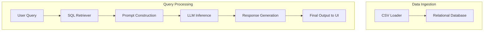
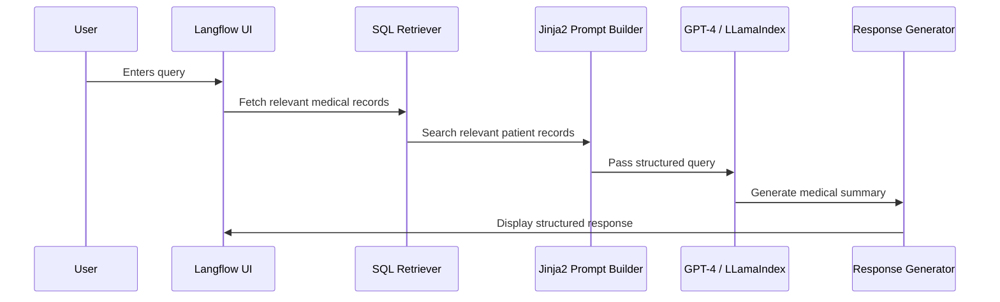

# Overview

This document provides an example that implements the [AI-Powered Clinical Summary Assistant](README.md) use case. 

Please note that the example implements only a subset of functional and technical requirements is intended for  demo purpose only.

# **Requriements**

## **Key Functional Requirements**

### **1. Medical Record Retrieval & Summarization**
- As a clinician, I should be able to access the medical records of a patient and receive an **AI-generated summary** answering predefined clinical questions:
    - Summarize the patient's recent lab results and highlight any abnormalities.
    - Provide an overview of the patient's reported symptoms and their progression over the last month.
    - What are the key points from the patient's last physical examination?
    - Highlight any noted allergies or adverse reactions documented in the patient's records.
    - Provide a timeline of the patient's major medical events and interventions.
    - Summarize the patient's family medical history pertinent to heart conditions.
    - What are the patient's previous surgical procedures and their outcomes?
    - Summarize the patient's immunization history and any upcoming due vaccines.

### **2. Interactive Querying**
- As a clinician, I should be able to **ask additional, patient-specific questions** and receive relevant, concise responses using online user interface.

## **Key Technical Requirements**

### **1. Retrieval-Augmented Generation (RAG) Framework**
- The solution should use a **RAG-based approach** to retrieve relevant medical records and generate accurate patient summaries. Specifically, LangChain framework.

### **2. Data Source**
- The system must load relational patient data from a set of csv files. These files are 
    - observations.csv
    - organizations.csv
    - patients.csv
    - payer_transitions.csv
    - payers.csv
    - procedures.csv
    - providers.csv
    - supplies.csv
    - allergies.csv
    - careplans.csv
    - claims.csv
    - claims_transactions.csv
    - conditions.csv
    - devices.csv
    - encounters.csv
    - imaging_studies.csv
    - immunizations.csv
    - medications.csv

### **3. Data Retrieval**
- The solution should use a **LangChain SQL chain** to **efficiently retrieve relevant patient records**.

### **4. Tech Stack**
- The system should be implemented using **Python** and Haystack RAG framework 

### **5. User Interface**
- The user interface should be based on Langflow.

### **6. Model Support**
- The solution should allow running prompts against SaaS and locally hosted models.

### **7. Prompt Templates**
- The solution should support prompt templates.

# Architecture

The solution architecture focuses on two major pipeline:

- **Data Retrieval**: Pulling relevant data from a read-only relational database in real time.
- **Request Processing**: Retrieving relevant data, generating responses via LLMs, and presenting results through an interactive UI.

## 1. Architectural Components

### 1.1 Data Retrieval
1. **CSV Data Loader**  
   - **Tool**: `pandas`  
   - **Reasoning**: Ingest structured CSV data into a database.

2. **Relational Database**  
   - **Tool**: `SQLite`  
   - **Reasoning**: is used as a datasource.

### 1.2 Request Processing
1. **Query Interface (Interactive UI)**  
   - **Tool**: `Langflow`  
   - **Reasoning**: Provides a no-code/low-code environment for query construction and LLM interaction.

2. **Retrieval-Augmented Generation (RAG) Framework**  
   - **Tool**: `LangChain`  
   - **Reasoning**: Provides a structured pipeline for data retrieval and response generation.

3. **SQL Retriever**  
   - **Tool**: `LangChain SQL Chain`
   - **Reasoning**: Uses a natural language prompt that gets converted into an appropriate SQL query to find the relevant medical data.

4. **Prompt Templates**  
   - **Tool**: `Jinja2`  
   - **Reasoning**: Enables structured prompt formatting for LLMs.

5. **LLM Integration**  
   - **Tools**: `OpenAI GPT-4` (for SaaS), `LLamaIndex` (for local models)  
   - **Reasoning**: Supports hybrid deployment models, allowing both cloud-based and on-prem inference.

6. **Response Generation & Summarization**  
   - **Tool**: `LangChain Prompt Templates`  
   - **Reasoning**: Ensures structured, template-based responses for consistent medical summaries.

---

## 2. Architectural Diagrams

### 2.1 Component View

The diagram below outlines the solution components grouped by pipeline.

### 2.2 Sequence Diagram

